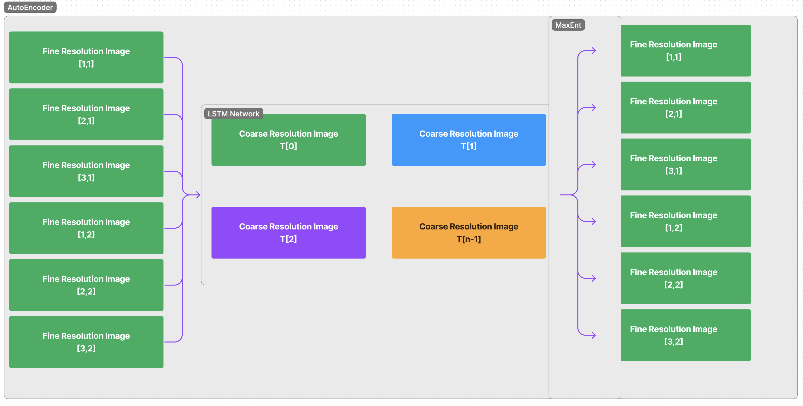

# Generative-AI based Spatio-Temporal Fusion for Video Super-Resolution through Up-Scaling and Frame-Interpolation (Ongoing Research)
## A Novel Approach leveraging Auto-Encoders, LSTM Networks and Maximum Entropy Principle.

### Kindly [Review Issues](https://github.com/iSiddharth20/Spatio-Temporal-Fusion-in-Remote-Sensing/issues) Section.

### [Dataset](https://www.kaggle.com/datasets/isiddharth/spatio-temporal-data-of-moon-rise-in-raw-and-tif) is now Available!

### [Click Here](./Documentation/Concept_Presentation.pptx) for Powerpoint Presentaion of Concept.

### High Level Overview of Concept :

## Thank You for Your Amazing Contribution!
